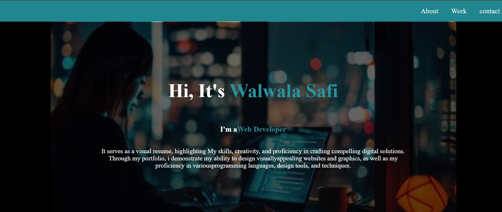

# Personal-portflio-webpage ✔✨

this is a personal-portfolio-webpage.  💙

Walwala Safi's portfolio showcases a collection of projects, including a personal portfolio website and a technical documentation page. With a focus on simplicity and elegance, it provides a glimpse into Farhat's skills in web development and design."This page contains the HTML and CSS.

✔👌Demo link:-- (https://walwalasafi.github.io/personal-portfolio-webpage/)

Demo 📸

Technologies Used 🛠️
🔹HTML
🔹CSS

Rquirements# 

1️⃣creat a new repository in your github

2️⃣Create a New Project Directory:

Open your terminal or command prompt. Navigate to the directory where you want to create your project. Run the following command to create a new directory for your project: bash Copy code mkdir documentation-project

3️⃣open HTML in any program such you want ssuch us: vscode, terminal and cmd.

4️⃣creat a uniqe HTML file.

5️⃣give a style to project by creating style.css file. 

6️⃣ use (git add, git commint, git push) in the git bash to push it in Github.

7️⃣Make a string and uniqe project-Readme.md file.

Author 🔵✅
Github: WALWALA SAFI (https://github.com/WALWALASAFI/product-landing-page.git)

Email: walwala safi (walwalasafi99@gmail.com)

